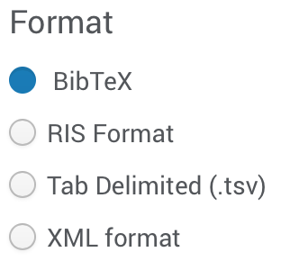

```{r setup, include=FALSE}
library(learnr)
tutorial_options(exercise.completion=TRUE)
knitr::opts_chunk$set(echo = FALSE)

library("DESeq2")
library("clusterProfiler")
library("org.Dm.eg.db")
library("tidyverse")

formatDESeq2Results <- function( x ) {
  df <- as.data.frame(x)
  df <- data.frame(rownames(df), df)
  colnames(df) <- c("GeneID", colnames(df)[-1])
  rownames(df) <- c()
  return(df)
}

runClusterProfiler <- function (x) {
  ids <- bitr( x$GeneID, "ENSEMBL", "ENTREZID", "org.Dm.eg.db" )
  kegg <- enrichKEGG(ids$ENTREZID, "dme", keyType="ncbi-geneid")
  return(kegg)
}
```


## Welcome {.splashpage}

{width=100%}

#### Learning Objectives:
* Objective 1
* Objective 2

#### Authors:
* Katherine Cox

```{r}
# Extract the tutorial version from the YAML data and store it so we can print it using inline r code below.  This can't be done directly inline because the code for extracting the YAML data uses backticks
tv <- rmarkdown::metadata$output$`learnr::tutorial`$version
```

#### Version: `r tv`

## Topic 1

### Exercise

test


## Topic 1

### Here's an image


### Exercise 

*Here's a simple exercise with an empty code chunk provided for entering the answer.*

Write the R code required to add two plus two:

```{r two-plus-two, exercise=TRUE}

```

### Exercise with Code

*Here's an exercise with some prepopulated code as well as `exercise.lines = 5` to provide a bit more initial room to work.*

Now write a function that adds any two numbers and then call it:

```{r add-function, exercise=TRUE, exercise.lines = 5}
add <- function() {
  
}
```

## Topic 2

### Exercise with Hint

*Here's an exercise where the chunk is pre-evaulated via the `exercise.eval` option (so the user can see the default output we'd like them to customize). We also add a "hint" to the correct solution via the chunk immediate below labeled `print-limit-hint`.*

Modify the following code to limit the number of rows printed to 5:

```{r print-limit, exercise=TRUE, exercise.eval=TRUE}
mtcars
```

```{r print-limit-hint}
head(mtcars)
```

### Quiz

*You can include any number of single or multiple choice questions as a quiz. Use the `question` function to define a question and the `quiz` function for grouping multiple questions together.*

Some questions to verify that you understand the purposes of various base and recommended R packages:

```{r quiz}
quiz(
  question("Which package contains functions for installing other R packages?",
    answer("base"),
    answer("tools"),
    answer("utils", correct = TRUE),
    answer("codetools")
  ),
  question("Which of the R packages listed below are used to create plots?",
    answer("lattice", correct = TRUE),
    answer("tools"),
    answer("stats"),
    answer("grid", correct = TRUE)
  )
)
```

